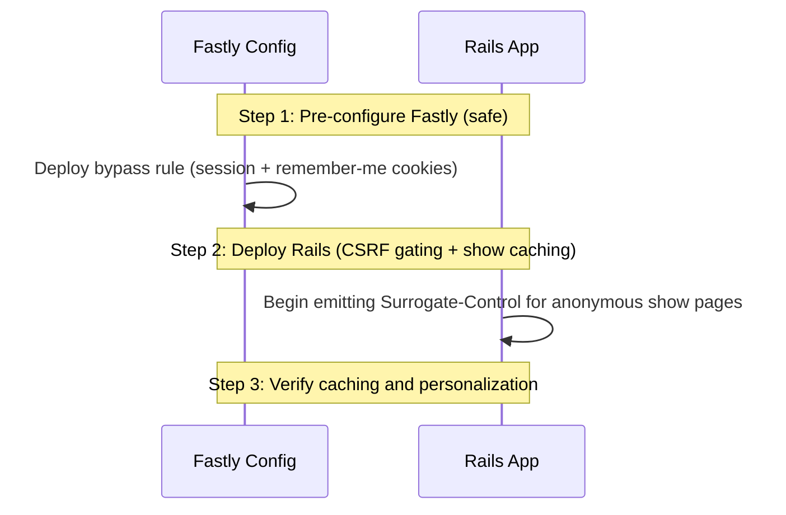

# CDN Caching for Anonymous Traffic

This document describes the design, rationale, and implementation plan to
increase CDN (Fastly) caching of "project show" pages for anonymous users
(web spiders and guest visitors) while ensuring that logged-in users, and
any user with personalized state (such as those receiving a stored
"flash" message) continue to receive correct, non-cached content.

The approach here deliberately **avoids adding a new cookie**. Instead it
treats the *presence of the existing Rails session cookie*
(`_BadgeApp_session`) as the single "do not cache" signal, and **minimizes
the number of situations in which we write anything into that cookie**. The
key enabling change is to stop emitting a CSRF token (and therefore a
session cookie) on anonymous read-only pages that do not need one.

---

## 1. Problem Statement

The Best Practices Badge application has over 10,000 projects, each with
multiple sections (currently 7) translated into 9 languages, totaling over
600,000 page combinations when doing a "show project".
Each "show project" page is about 200KiB. Currently, our CDN
(Fastly) is a pass-through for all HTML page requests, and only a few
kinds of resources (such as badge images) are cached by the CDN.

Because multiple web spiders and crawlers constantly trawl the site without
breaks, the Rails origin server receives a high volume of heavy HTML
rendering requests. This leads to server load spikes, database strain,
latency issues, and overwhelming log entries.

We want the CDN to serve cached copies of "project show" pages to anonymous
visitors (especially spiders) who are not receiving personalized content,
while never serving a cached page to a user who should see personalized
content (logged-in users, users with a flash message, etc.).

---

## 2. Why Not Add a New Cookie?

An earlier draft proposed adding a new public, unencrypted cookie (e.g.
`user_logged_in=true`) set only when a user is authenticated, and bypassing
the CDN cache only when that cookie is present. The reasoning was that
anonymous guests "occasionally" receive a `_BadgeApp_session` cookie for
transient reasons (CSRF tokens, flash messages), so keying the CDN bypass
on `_BadgeApp_session` would needlessly bypass the cache for those guests
and lower the hit rate.

That reasoning is real, but a new cookie is the wrong fix:

* **It duplicates state.** The login status would now live in two places
  (the encrypted session *and* a plaintext cookie) that must be kept in
  sync. Drift between them is a latent source of bugs.
* **It is a new, misleading attack surface.** A plaintext `user_logged_in`
  cookie reads like an authentication flag to reviewers and auditors even
  though it is only a CDN routing hint. Minimizing such surfaces is a core
  project value.
* **It tracks the wrong thing.** It signals "logged in", but what we
  actually must not cache is "anything personalized" — which includes
  flash messages and any future per-user session state, not just login.
  The session cookie already captures *all* of that.
* **It is unnecessary.** The supposed benefit (guests carrying a session
  cookie) largely disappears once we stop writing the session cookie
  gratuitously. The dominant cause of guests carrying `_BadgeApp_session`
  is the CSRF token emitted on every page — and anonymous read-only pages
  do not need it (see Section 4).

Additional context on cookie retention: the primary load source is web
spiders, and major crawlers (Googlebot, Bingbot, and most simple HTTP
clients) are **stateless and do not retain cookies**. They therefore arrive
with no `_BadgeApp_session` at all and are cached cleanly under either
design. The new-cookie advantage only ever applied to *cookie-retaining
humans*, which is exactly the population we address below by not setting the
cookie in the first place.

**Decision:** Use `_BadgeApp_session` presence as the cache-bypass signal,
fail safe (any session state ⇒ bypass), and minimize when we set it.

---

## 3. How `_BadgeApp_session` Gets Set (Complete Enumeration)

`_BadgeApp_session` is Rails' encrypted `cookie_store` session
(`config/initializers/session_store.rb`). Rails emits a
`Set-Cookie: _BadgeApp_session=...` response header whenever a request
*writes* data into the session (and the write is not suppressed — see
`omit_session_cookie` below). Once set, the browser sends the cookie on
**every** subsequent request until it expires or the session is reset. So
to keep the cookie absent for anonymous read-only traffic, we must avoid
*every* write below for that traffic.

Reading the session (e.g. `session[:user_id]`) does **not** write it; only
the following do.

### A. Authentication and session lifecycle (logged-in users)

These are expected and correct — logged-in users must not be served cached
anonymous pages, so setting the cookie here is exactly what we want.

1. **Successful login.** `log_in` writes `session[:user_id]` and
   `session[:time_last_used]`
   ([`app/helpers/sessions_helper.rb:49-50`](../app/helpers/sessions_helper.rb)),
   and rewrites `session[:forwarding_url]` if present (line 55).
2. **Remember-me auto-login.** `try_remember_token_login` writes
   `session[:user_id]` and `session[:time_last_used]`
   ([`app/controllers/application_controller.rb:573-574`](../app/controllers/application_controller.rb))
   when a returning user is logged in from the persistent
   `remember_token` / `user_id` cookies.
3. **Session timestamp refresh.** `update_session_timestamp` (an
   `after_action`) writes `session[:time_last_used]`
   ([`app/controllers/application_controller.rb:551`](../app/controllers/application_controller.rb)).
   It returns early unless `@session_user_id` is set, so it never fires for
   anonymous users.
4. **GitHub OAuth callback.** Writes `session[:user_token]` and
   `session[:github_name]`
   ([`app/controllers/sessions_controller.rb:136-137`](../app/controllers/sessions_controller.rb)).

### B. Pre-login navigation memory (can affect anonymous users)

These happen *before* a user is authenticated, so they can set the cookie
for an otherwise-anonymous visitor. They occur only on the login / signup
flow and on pages that require login, none of which are cacheable, so they
do not interfere with caching the *show* page — but they are listed for
completeness.

5. **`store_location_and_locale`** writes `session[:locale]` (always) and
   `session[:forwarding_url]`
   ([`app/helpers/sessions_helper.rb:281-294`](../app/helpers/sessions_helper.rb)).
   Called from the login flow
   ([`app/controllers/sessions_controller.rb:28`](../app/controllers/sessions_controller.rb))
   and from `projects#new`
   ([`app/controllers/projects_controller.rb:568`](../app/controllers/projects_controller.rb)).
6. **`store_internal_referer`** writes `session[:forwarding_url]`
   ([`app/helpers/sessions_helper.rb:347`](../app/helpers/sessions_helper.rb)).
7. **`projects#new`** writes `session[:forwarding_url] = new_project_url`
   ([`app/controllers/projects_controller.rb:571`](../app/controllers/projects_controller.rb)).

### C. Flash messages (stored in the session)

The flash lives in the session, so setting a *persistent* flash writes the
cookie.

8. **Persistent flash** — `flash[:danger|success|info|warning|notice|error]
   = ...`. These are set throughout the controllers, e.g. login
   success/failure and sign-out
   ([`sessions_controller.rb`](../app/controllers/sessions_controller.rb)),
   signup and profile/delete
   ([`users_controller.rb`](../app/controllers/users_controller.rb)),
   project create / update / delete and badge changes
   ([`projects_controller.rb`](../app/controllers/projects_controller.rb)),
   password reset
   ([`password_resets_controller.rb`](../app/controllers/password_resets_controller.rb)),
   account activation
   ([`account_activations_controller.rb`](../app/controllers/account_activations_controller.rb)),
   and unsubscribe
   ([`unsubscribe_controller.rb`](../app/controllers/unsubscribe_controller.rb)).
   A persistent flash is carried to the **next** request: the response that
   sets it emits `Set-Cookie`, and the browser then sends `_BadgeApp_session`
   on following requests until the flash is displayed and swept.

   * **`flash.now[...]`** is request-local: it is swept at the end of the
     current request and, if it is the only session data, leaves the
     session empty, so it does **not** persist a cookie to later requests.
     (During the current render `flash.empty?` is still false, so the show
     action's guard below will not cache that particular response anyway.)

### D. CSRF protection (the dominant cause for anonymous read-only pages)

9. **`csrf_meta_tags` in the layout `<head>`**
   ([`app/views/layouts/application.html.erb:7`](../app/views/layouts/application.html.erb)).
   When forgery protection is active (always in production), this helper
   calls `form_authenticity_token`, which executes
   `session[:_csrf_token] ||= ...`. It is currently emitted on **every**
   rendered page, including anonymous read-only pages that contain no forms
   and no JavaScript that uses the token. This single line is why ordinary
   human guests accumulate a `_BadgeApp_session` cookie. (When forgery
   protection is disabled — as in the test environment — `csrf_meta_tags`
   emits nothing and writes nothing; see the testing caveat in Section 6.)
10. **Form helpers** (`form_with` / `form_tag`) embed a hidden
    `authenticity_token` field, which also writes `session[:_csrf_token]`
    when the form is rendered. This applies to login, signup, password
    reset, unsubscribe, account activation, and project new/edit/delete
    forms. These pages are personalized and/or POST targets and are not
    cacheable, so this write is acceptable.

### Summary of what matters for caching the show page

For an **anonymous GET of a read-only page**, the only write that normally
fires is **item 9 (the CSRF meta tag)**. Items 1–4 require being logged in,
items 5–7 require the login/new-project flow, item 8 (persistent) requires
an action that sets a flash, and item 10 requires rendering a form.
Eliminating item 9 for anonymous read-only pages removes the gratuitous
session cookie and makes "`_BadgeApp_session` is present" a precise signal
for "this response may be personalized — do not cache".

---

## 4. The Approach

Three coordinated changes:

1. **Stop writing the CSRF token on anonymous read-only pages** by making
   `csrf_meta_tags` conditional. Forms keep working because `form_with`
   embeds its own hidden `authenticity_token` independent of the meta tag,
   and the only JavaScript consumer of the meta tag (jQuery UJS
   `link_to ... method:` links such as logout and user-delete) appears only
   on logged-in pages.
2. **Enable CDN caching of anonymous `projects#show` HTML** when there is no
   per-user state, reusing the existing `cache_on_cdn` (which already calls
   `omit_session_cookie`, guaranteeing no `Set-Cookie` on the cached
   response).
3. **Configure Fastly** to bypass the cache for page requests whenever the
   request carries `_BadgeApp_session` *or* the persistent remember-me
   cookies (`remember_token` / `user_id`).

### Why this is safe

* **The core correctness invariant: the anonymous show response does not vary
  between anonymous users.** Caching a single object and serving it to all
  anonymous visitors is correct *only* if every anonymous visitor would have
  received byte-identical content. This holds because the only things that
  personalize a show page are login-derived or carried in the URL.
  `show.html.erb` branches solely on `@cached_can_edit` (`can_edit?`) and
  `can_control?`
  ([`app/views/projects/show.html.erb:5,23,26`](../app/views/projects/show.html.erb)),
  both of which derive from `current_user` and are always false for an
  anonymous request (yielding the read-only `_table` / `_details` rendering);
  the header's account menu, logout, and edit affordances are gated on
  `@session_user_id`
  ([`app/views/layouts/_header.html.erb`](../app/views/layouts/_header.html.erb)),
  so all anonymous users get the same login/signup header; locale is in the URL
  (`/en/projects/:id/:section`) and thus part of the cache key, not hidden
  variance; and after Change 1 the CSRF meta tag — the one remaining
  per-session value in the layout `<head>` — is absent for anonymous users.
  There is therefore no anonymous-only variance by IP, `Accept-Language` (the
  locale redirect happens *before* `show`; see Section 4.1), A/B assignment, or
  request time. This invariant is locked in by an explicit "two anonymous
  requests are byte-identical" test (Section 6) and by the page-variance
  reasoning in Section 9.4.
* The CDN bypass is **fail-safe**: *any* session state (login, flash, CSRF,
  or future per-user data) means the cookie is present, so the request is
  passed to the origin and the personalized response is rendered fresh.
* `cache_on_cdn`
  ([`app/controllers/application_controller.rb:211-232`](../app/controllers/application_controller.rb))
  sets the CDN headers and then suppresses the session cookie:

  ```ruby
  def cache_on_cdn
    response.headers['Surrogate-Control'] = BADGE_CACHE_SURROGATE_CONTROL
    response.headers['Cache-Control'] = 'no-store'
    omit_session_cookie
  end
  ```

  `omit_session_cookie`
  ([`app/controllers/application_controller.rb:288-290`](../app/controllers/application_controller.rb))
  sets `request.session_options[:skip] = true`, so a cached anonymous
  response never carries a `Set-Cookie` header even if rendering touched the
  session in memory. (`Cache-Control: no-store` is for browsers and other
  intermediaries; the CDN obeys the private `Surrogate-Control` instead.)
* Logged-in users vary the page header (account menu, logout, edit
  buttons). They always carry `_BadgeApp_session`, so they always bypass the
  cache and never receive the anonymous header.
* Remember-me users whose 48-hour session
  (`SessionsHelper::SESSION_TTL`) has expired may arrive **without**
  `_BadgeApp_session` but **with** the persistent `remember_token` /
  `user_id` cookies; the Fastly rule bypasses the cache for those cookies
  too, so they are not served a cached anonymous page.

### 4.1 Redirects and caching

A redirect that depends on per-browser request values (e.g. `Accept-Language`)
**must not be cached**, or one browser's target would be served to everyone.
We must therefore confirm that enabling show-page caching never lets a
browser-dependent redirect be cached. There are three redirects on the path
to a project show page; all are handled correctly:

1. **Locale redirect** — `redir_missing_locale`
   ([`application_controller.rb:400-428`](../app/controllers/application_controller.rb))
   sends a no-locale URL to the best locale based on `Accept-Language`, so it
   **is** browser-dependent. It already protects itself: it calls
   `disable_cache` (`Cache-Control: private, no-store`) and uses **302**, not
   301, with this exact rationale in the code:

   ```ruby
   # Where we go varies by browser, so we can't cache this redirect
   disable_cache
   # ... we must avoid 301 (Moved Permanently) ...
   redirect_to preferred_url, status: :found
   ```

   It runs as an early `before_action` (before `set_default_cache_control`)
   and halts the chain, so the `show` action — and our caching — never run
   for it. **Unaffected by this change.**

2. **Default-section redirect** — `redirect_to_default_section`
   ([`projects_controller.rb:454`](../app/controllers/projects_controller.rb))
   sends `/projects/:id` to its default section. It is **not**
   browser-dependent (the section is fixed; the locale is already in the
   URL) and uses 301. It is a separate action that never calls `cache_on_cdn`,
   so `set_default_cache_control` leaves it `private, no-store` (uncached).
   Conservative and **unaffected by this change**.

3. **Obsolete-section redirect** — `redirect_obsolete_section_names`
   ([`projects_controller.rb:1441-1448`](../app/controllers/projects_controller.rb))
   runs *inside* `show` and 301-redirects obsolete names (`0` → `passing`).
   It is **not** browser-dependent. But because `show` continues executing
   after it redirects, our new HTML branch (and the pre-existing `:md` branch)
   would otherwise attach `cache_on_cdn` headers to the redirect. The
   `return if performed?` guard in Change 2 prevents that: once any redirect
   is committed, `show` stops, leaving the redirect with its
   `set_default_cache_control` value (`private, no-store`). This also
   future-proofs `show` — if a browser-dependent redirect is ever added
   there, caching still cannot attach to it.

In short: the one browser-dependent redirect (locale) is already
non-cacheable by design, and the `return if performed?` guard ensures our
change never caches any redirect emitted from within `show`.

### 4.2 Content encoding (`Vary` / `Accept-Encoding`)

Caching anonymous HTML introduces a content type whose on-the-wire bytes vary
with compression (`Accept-Encoding: gzip, br, …`). This is **not new risk**:
the resources we already cache (project JSON and the SVG badges via the same
`cache_on_cdn` path) are likewise compressible, and Fastly handles encoding
the same way for HTML as for those. Fastly normalizes `Accept-Encoding` into a
small number of buckets and stores a separate compressed object per bucket, so
a client never receives an encoding it did not request. We therefore do not
set or change any `Vary` header: HTML show pages inherit exactly the encoding
behavior the already-cached JSON and badge responses rely on today. (Locale is
not an encoding concern — it is in the URL and thus already part of the cache
key; see Section 4.1.) If Fastly's default `Accept-Encoding` normalization is
ever disabled for this service, that change must be treated as cache-affecting
and re-reviewed, because it would apply equally to the existing cached JSON
and badges.

---

## 5. Exact Code Changes

### Change 1: Make `csrf_meta_tags` conditional

In [`app/views/layouts/application.html.erb`](../app/views/layouts/application.html.erb),
replace the unconditional tag:

```erb
  <%= csrf_meta_tags %>
```

with a guarded version:

```erb
  <%#
    Only emit the CSRF token when it can actually be used. Emitting it calls
    form_authenticity_token, which writes session[:_csrf_token] and forces a
    _BadgeApp_session cookie -- defeating CDN caching for anonymous visitors.
    Anonymous read-only pages need no token: form_with embeds its own hidden
    authenticity_token (so login/signup/reset forms still work), and the only
    JavaScript consumer of this meta tag (jQuery UJS "method:" links such as
    logout and user-delete) appears only on logged-in pages. See
    docs/cdn-cache-not-logged-in.md.
  -%>
  <% if logged_in? %><%= csrf_meta_tags %><% end %>
```

`logged_in?` is the existing `SessionsHelper` predicate
(`@session_user_id.present?`) and is available in views.

### Change 2: Cache anonymous `projects#show` HTML

In [`app/controllers/projects_controller.rb`](../app/controllers/projects_controller.rb),
the `show` action first calls `redirect_obsolete_section_names` (which can
issue a 301 redirect, e.g. `0` → `passing`) and currently caches only the
markdown format. The real action does several things between the redirect
call and the cache line — section normalization, surrogate-key tagging, and
section data loading — all of which run **even when a redirect was already
issued** (the quote below is abbreviated only by the `# ...` comments; the
named calls are present verbatim):

```ruby
  def show
    redirect_obsolete_section_names

    @section = @criteria_level
    validate_section(@section)

    # Tell CDN the surrogate key so we can quickly erase cache later
    set_surrogate_key_header @project.record_key

    load_section_data_for_show(@section)

    # Enable CDN caching for markdown format (no user-specific content)
    cache_on_cdn if request.format.symbol == :md

    respond_to do |format|
      format.html
      format.md { render_markdown_format }
    end
  end
```

Make two edits. **First, bail out the moment a redirect has been performed**,
so neither the section-loading work, the caching logic, nor the `respond_to`
runs for a redirect response (see Section 4.1 — *Redirects and caching*). Add
immediately after `redirect_obsolete_section_names`, **before** the
`@section = @criteria_level` line:

```ruby
    redirect_obsolete_section_names
    # A redirect (e.g. obsolete section 301) already committed the response;
    # do not attach page-caching headers, reload section data, or render
    # again. Its cache headers were set by set_default_cache_control
    # (private, no-store).
    return if performed?
```

**Behavioral note — the obsolete-section 301 loses its `Surrogate-Key`.**
Today, because execution falls through, an obsolete-section redirect still
runs `set_surrogate_key_header @project.record_key` and so carries a
`Surrogate-Key`. With the guard placed before that line, the redirect no
longer gets one. This is harmless and arguably more correct: the redirect is
`private, no-store` and is never cached, so it has no cache entry to purge by
key. (The relevant assertion in Section 6 checks `Surrogate-Control`, the
header that actually gates CDN caching — not `Surrogate-Key`.)

**Second, replace the markdown-only cache line** with a guard that also
caches anonymous, flash-free HTML:

```ruby
    # Enable CDN caching when the response carries no per-user state.
    #   - :md is always safe (no layout/header, no forms, no CSRF token).
    #   - :html is safe only when the user is not logged in AND there is no
    #     flash, and only when the CACHE_SHOW_PROJECT kill switch is on.
    # cache_on_cdn also calls omit_session_cookie, so no Set-Cookie is sent.
    if request.format.symbol == :md ||
       (CACHE_SHOW_PROJECT && request.format.symbol == :html &&
        !logged_in? && flash.empty?)
      cache_on_cdn
    end
```

`CACHE_SHOW_PROJECT` already exists
([`projects_controller.rb:110`](../app/controllers/projects_controller.rb),
from `ENV['BADGEAPP_CACHE_SHOW_PROJECT']`) and serves as the kill switch:
set `BADGEAPP_CACHE_SHOW_PROJECT=false` to instantly fall back to
`private, no-store` for HTML show pages without a redeploy.

No change is needed to `cache_on_cdn`, `omit_session_cookie`, or
`set_default_cache_control`; the default for any non-cached response remains
`private, no-store`.

> **Existing test to update.** `test/integration/project_get_test.rb`
> requests the show page **anonymously** (its `@user` line is commented out)
> and asserts `Cache-Control: private, no-store`
> ([`project_get_test.rb:34-38`](../test/integration/project_get_test.rb)).
> After this change an anonymous show response is `no-store` (plus
> `Surrogate-Control`), so update that assertion to `no-store`.

### Change 3: Fastly configuration

Bypass the cache for page requests (not assets, badges, or JSON) whenever
the request carries the session cookie or the persistent remember-me
cookies.

#### Option A: Fastly Web UI Request Setting (recommended)

* **Name:** `Bypass cache for personalized requests`
* **Action:** `Pass`
* **Condition** — Apply if:

  ```text
  req.http.Cookie ~ "(_BadgeApp_session|remember_token|user_id)=" && req.url.path !~ "\.(css|js|png|gif|jpg|jpeg|svg|json|csv|txt|ico|woff2?|map)$" && req.url.path !~ "/(badge|baseline)$"
  ```

#### Option B: Custom VCL snippet (placement: `recv`)

```vcl
# Page requests only (not static assets, badges, or JSON APIs).
if (req.url.path !~ "\.(css|js|png|gif|jpg|jpeg|svg|json|csv|txt|ico|woff2?|map)$" &&
    req.url.path !~ "/(badge|baseline)$") {

  # Bypass the cache for any request that may be personalized:
  # an active Rails session, or a persistent remember-me login.
  if (req.http.Cookie ~ "(_BadgeApp_session|remember_token|user_id)=") {
    return(pass);
  }
}

# Maximize the guest hit rate: drop cookies unrelated to login/session so
# that otherwise-identical anonymous requests share one cache object.
if (req.http.Cookie && req.http.Cookie !~ "(_BadgeApp_session|remember_token|user_id)=") {
  unset req.http.Cookie;
}
```

### 5.1 This change is purely additive — existing caching is unchanged

This change **only adds** CDN caching for anonymous project *show HTML*.
Everything the site caches today keeps caching exactly as before; no existing
cached resource loses or changes its caching. CDN caching is enabled in
exactly four places (every call site of `cache_on_cdn`), and our edits touch
only the show-HTML case:

| Cached resource | Enabled at | Changed? |
| --- | --- | --- |
| Project **JSON** (`show_json`) | [`projects_controller.rb:105`](../app/controllers/projects_controller.rb) (`before_action :cache_on_cdn, only: %i[badge baseline_badge show_json]`) | No |
| **Badge images** (`badge`, `baseline_badge`) | [`projects_controller.rb:105`](../app/controllers/projects_controller.rb) (same `before_action`) | No |
| **Static badges** | [`badge_static_controller.rb:15`](../app/controllers/badge_static_controller.rb) (`before_action :cache_on_cdn, only: %i[show]`) | No |
| Project **`.md`** | [`projects_controller.rb:429`](../app/controllers/projects_controller.rb) (`cache_on_cdn if request.format.symbol == :md`) | Preserved |
| Project **show HTML** | `show` guard (Change 2) | **Added** |

Two facts make this safe:

1. **The `.md` branch is preserved, not replaced.** Change 2 keeps markdown
   caching by OR-ing the new HTML condition onto the existing one
   (`request.format.symbol == :md || (… :html …)`). Markdown is also rendered
   with `layout: false`
   ([`render_markdown_format`, `projects_controller.rb:1471-1478`](../app/controllers/projects_controller.rb)),
   so it never emits the layout's CSRF tag and is untouched by Change 1.
2. **Change 1 (conditional `csrf_meta_tags`) affects only responses that
   render the application layout** — i.e., HTML pages. JSON responses, `.md`
   (`layout: false`), and SVG badges do not render
   [`app/views/layouts/application.html.erb`](../app/views/layouts/application.html.erb),
   so none of them are affected.

The only redirect-related effect is the `return if performed?` guard in
`show`, which *stops* caching the obsolete-section 301 (a latent over-cache
in today's `:md` path); it does not alter any JSON, badge, or `.md` content
response.

---

## 6. Tests to Ensure It Is Secure

These tests lock in the security-critical invariants. The most important is
the negative one: an anonymous read-only request must never carry a session
cookie, because that is the property the CDN bypass relies on.

> **Critical testing caveat.** Request forgery protection is **disabled** in
> the test environment
> ([`config/environments/test.rb:49`](../config/environments/test.rb)):
>
> ```ruby
> config.action_controller.allow_forgery_protection = false
> ```
>
> When it is off, Rails' `csrf_meta_tags` emits nothing and never writes
> `session[:_csrf_token]` — so a test of "anonymous pages set no session
> cookie" would pass *trivially*, even without our change, and a test that
> the meta tag appears for logged-in users would *fail* (it would be absent
> for everyone). Therefore the CSRF-sensitive tests below must explicitly
> re-enable forgery protection. Note that re-enabling it makes unprotected
> `POST`s fail, so log in (which `POST`s to `login_path`) *before* enabling
> it. The tests use a `with_forgery_protection` helper that flips the flag and
> restores it in an `ensure`. It is defined once at the bottom of the test
> class below — do not also paste it here, or it would be a duplicate
> definition.

Add an integration test (e.g. `test/integration/cdn_caching_test.rb`):

```ruby
# frozen_string_literal: true

# Copyright the OpenSSF Best Practices badge contributors
# SPDX-License-Identifier: MIT

require 'test_helper'

class CdnCachingTest < ActionDispatch::IntegrationTest
  setup do
    @project = projects(:one)
  end

  # The CDN treats "has _BadgeApp_session" as "do not cache". Anonymous
  # read-only pages must therefore NOT set that cookie. If this fails, the
  # CDN would needlessly bypass the cache for ordinary guests.
  # The page list is deliberately broad: if someone later adds anonymous
  # UJS/AJAX (which would force the CSRF meta tag back on) to a common page,
  # this test trips. Add new anonymous read-only pages here as they appear.
  # Note: "/en/projects/:id" (project_redirect) is a redirect to the default
  # section; the rendered show page is "/en/projects/:id/:section".
  test 'anonymous read-only GETs set no session cookie' do
    with_forgery_protection do
      [
        '/en',
        '/en/projects',
        "/en/projects/#{@project.id}/passing",
        '/en/feed'
      ].each do |path|
        get path
        assert_response :success
        assert_nil cookies['_BadgeApp_session'],
                   "#{path} unexpectedly set _BadgeApp_session"
        assert_not response.headers['Set-Cookie'].to_s.include?(
          '_BadgeApp_session'
        ), "#{path} unexpectedly emitted a session Set-Cookie"
      end
    end
  end

  # Anonymous project show (HTML) is cacheable: it must advertise a
  # Surrogate-Control header to the CDN and must not emit a session cookie.
  test 'anonymous project show is CDN-cacheable' do
    with_forgery_protection do
      get "/en/projects/#{@project.id}/passing"
      assert_response :success
      assert response.headers['Surrogate-Control'].present?,
             'show should send Surrogate-Control for the CDN'
      assert_equal 'no-store', response.headers['Cache-Control']
      assert_nil cookies['_BadgeApp_session']
    end
  end

  # CORE CORRECTNESS INVARIANT (Sections 4.1 and 9.4): the CDN serves one
  # cached object to every anonymous visitor, so two anonymous show responses
  # must be byte-identical. All show-page personalization is login-derived
  # (can_edit?, can_control?, the @session_user_id header gate) or carried in
  # the URL (locale, section); an anonymous request has nothing left to vary.
  # If a future change adds anonymous-only variance (an IP-, Accept-Language-,
  # A/B-, or time-dependent fragment in the body or header), this test fails.
  test 'anonymous project show is identical across requests' do
    with_forgery_protection do
      get "/en/projects/#{@project.id}/passing"
      assert_response :success
      first_body = response.body
      get "/en/projects/#{@project.id}/passing"
      assert_response :success
      assert_equal first_body, response.body,
                   'anonymous show responses must be byte-identical so the ' \
                   'CDN can safely share one cached object among all guests'
    end
  end

  # Logged-in users must bypass the cache: a private, non-cacheable response.
  test 'logged-in project show is not CDN-cacheable' do
    log_in_as(users(:test_user)) # POSTs login; do this before enabling CSRF
    with_forgery_protection do
      get "/en/projects/#{@project.id}/passing"
      assert_response :success
      assert_equal 'private, no-store', response.headers['Cache-Control']
    end
  end

  # The CSRF meta tag must be absent for anonymous users (so no session
  # cookie is written) and present for logged-in users (UJS links need it).
  test 'csrf meta tag is gated on login' do
    with_forgery_protection do
      get "/en/projects/#{@project.id}/passing"
      assert_select 'meta[name="csrf-token"]', count: 0
    end

    log_in_as(users(:test_user))
    with_forgery_protection do
      get "/en/projects/#{@project.id}/passing"
      assert_select 'meta[name="csrf-token"]', count: 1
    end
  end

  # An obsolete-section 301 from inside show must NOT be cached: the
  # "return if performed?" guard keeps cache_on_cdn from attaching to it.
  test 'obsolete-section redirect is not CDN-cacheable' do
    get "/en/projects/#{@project.id}/0" # "0" -> "passing"
    assert_response :moved_permanently
    assert_equal 'private, no-store', response.headers['Cache-Control']
    assert_nil response.headers['Surrogate-Control']
  end

  # A locale redirect varies by Accept-Language and must never be cached.
  test 'locale redirect is not cacheable' do
    get "/projects/#{@project.id}/passing" # no locale in URL
    assert_response :found # 302, not 301
    assert_equal 'private, no-store', response.headers['Cache-Control']
  end

  def with_forgery_protection
    original = ActionController::Base.allow_forgery_protection
    ActionController::Base.allow_forgery_protection = true
    yield
  ensure
    ActionController::Base.allow_forgery_protection = original
  end
end
```

A flash present when `show` renders must also suppress caching. This project
uses `ActionDispatch::IntegrationTest` throughout (it intentionally avoids
the obsolete `ActionController::TestCase`), and an integration test cannot
inject an *incoming* flash directly. Instead, set a real **persistent** flash
with one request and let the next request (the show page) render it.
`password_resets#create` is a stable anonymous source: it always sets
`flash[:info]` and redirects
([`app/controllers/password_resets_controller.rb:33-47`](../app/controllers/password_resets_controller.rb)).
Add this test to `CdnCachingTest`:

```ruby
# A show page that renders a carried-over flash is per-user content and must
# not be CDN-cached. (No forgery protection here: test env disables it, and
# this exercises the flash guard, not CSRF.)
test 'project show rendering a carried-over flash is not CDN-cacheable' do
  # Sets a persistent flash[:info] in the session, then redirects.
  post '/en/password_resets',
       params: { password_reset: { email: 'nobody@example.org' } }
  assert response.redirect?
  # The next rendered page displays that flash, so show must skip caching.
  get "/en/projects/#{@project.id}/passing"
  assert_response :success
  assert_equal 'private, no-store', response.headers['Cache-Control'],
               'show rendering a carried-over flash must not be cached'
end
```

Finally, confirm existing CSRF behavior still holds (these paths must keep
working even though the meta tag is gone for anonymous users, because forms
supply their own token via `form_with`). The suite already exercises these;
verify they still pass:

* **Login** succeeds via the `sessions/new` form (POST validates the
  hidden `authenticity_token`).
* **Signup** succeeds via the `users/new` form.
* **Password reset** request and update succeed.
* **Logout** works for a logged-in user (the UJS `method: "delete"`
  link relies on the meta tag, which *is* present when logged in).

---

## 7. Rollout Order

Deploy Fastly first; it is safe because Rails is not yet emitting cacheable
HTML, so Fastly keeps passing all HTML through.



1. **Deploy Fastly bypass rule** (Section 5, Change 3). Until Rails sends
   `Surrogate-Control`, Fastly still passes all HTML to the origin.
2. **Deploy Rails changes** (Section 5, Changes 1 and 2). Anonymous show
   pages immediately become cacheable; the already-active bypass rule keeps
   logged-in and remember-me users on the origin.
3. **Verify** with the staging tests below; if anything is wrong, set
   `BADGEAPP_CACHE_SHOW_PROJECT=false` to disable HTML caching instantly.

---

## 8. How to Verify on Staging

The rendered show page is the canonical section URL
(`/en/projects/:id/:section`); `/en/projects/:id` only redirects to it, so
the tests below target the section URL directly.

### Anonymous request is cached

```bash
curl -svo /dev/null -H "Fastly-Debug: 1" \
  https://staging.bestpractices.dev/en/projects/1/passing 2>&1 \
  | grep -E "X-Cache|Surrogate-Control|Cache-Control|Set-Cookie"
# Run twice: first MISS then HIT. There must be NO Set-Cookie:_BadgeApp_session.
```

### Request carrying a session cookie bypasses the cache

```bash
curl -svo /dev/null -H "Fastly-Debug: 1" \
  -H "Cookie: _BadgeApp_session=anything" \
  https://staging.bestpractices.dev/en/projects/1/passing 2>&1 \
  | grep -E "X-Cache|Cache-Control"
# Must be PASS/MISS, never HIT; Cache-Control: private, no-store.
```

### Remember-me cookie bypasses the cache

```bash
curl -svo /dev/null -H "Fastly-Debug: 1" \
  -H "Cookie: remember_token=anything" \
  https://staging.bestpractices.dev/en/projects/1/passing 2>&1 \
  | grep -E "X-Cache|Cache-Control"
# Must be PASS/MISS, never HIT.
```

### Badges and JSON still cache regardless of cookies

```bash
curl -svo /dev/null -H "Fastly-Debug: 1" \
  -H "Cookie: _BadgeApp_session=anything" \
  https://staging.bestpractices.dev/en/projects/1.json 2>&1 | grep -E "X-Cache"
# Second request must be HIT.
```

---

Each risk below lists its failure mode and how we reduce it. Several are
already mitigated by existing infrastructure; the rest are covered by the
tests in Section 6 or by a documented convention.

### 9.1 A future anonymous page needs the CSRF token (fail-safe)

If a future page adds an anonymous `link_to ... method:`, a UJS-driven
non-GET link, or an anonymous non-GET AJAX call, it would need the meta tag,
which our change omits for anonymous users.

* **Failure mode is safe, not a bypass.** A missing token makes the
  *non-GET action* fail CSRF validation (HTTP 422) — a visible functional
  break in the new feature, never a security hole or a cache leak. GET pages
  are unaffected (Rails does not CSRF-check GET).
* **`button_to` and `form_with` are unaffected** — they embed their own
  hidden `authenticity_token`, independent of the meta tag, so ordinary
  anonymous forms (login, signup, password reset, unsubscribe, account
  activation) keep working.
* **Reduced by automation.** The "anonymous read-only GETs set no session
  cookie" test iterates over a list of anonymous pages; adding UJS/AJAX to
  any of them flips the meta tag back on and trips the test. Keep that list
  current as anonymous pages are added.
* **Do better (opt-in escape hatch).** If a specific anonymous page ever
  legitimately needs the token, it should opt in explicitly rather than
  forcing it globally. For example, gate the layout on login *or* an
  explicit request:

  ```erb
  <% if logged_in? || content_for?(:needs_csrf_meta) %><%= csrf_meta_tags %><% end %>
  ```

  and have that one page set `content_for(:needs_csrf_meta) { true }`. This
  keeps the default (no token, cacheable) safe while making the exception
  loud and local.

### 9.2 A persistent flash reaches an anonymous user

`projects#show` itself sets **no** flash on its render path
([`app/controllers/projects_controller.rb:414-436`](../app/controllers/projects_controller.rb)),
so the only way an anonymous visitor sees a flash on a show page is by being
redirected into it with a persistent `flash[...]` (e.g., an error elsewhere).

* **Doubly safe.** Such a response is not cached: the show guard sees a
  non-empty `flash` (`flash.empty?` is false) and skips `cache_on_cdn`, and
  the request already carries `_BadgeApp_session` (set when the flash was
  stored), so Fastly bypasses the cache anyway. The lingering cookie merely
  costs cache hits for that one browser until the flash is swept.
* **Do better (convention + verification).** Prefer `flash.now[...]` for
  messages shown on a `render` (not a redirect); it is request-local and
  leaves no lingering cookie (Section 3.C). The "anonymous read-only GETs
  set no session cookie" test guards the common read-only pages against an
  accidental persistent flash on those paths.

### 9.3 Stale cached pages after an edit — already handled

Caching anonymous show HTML reuses the **existing** purge path, because the
show page is tagged with the project's surrogate key and edits already purge
that exact key.

* Show tags the response:
  [`app/controllers/projects_controller.rb:423`](../app/controllers/projects_controller.rb)
  — `set_surrogate_key_header @project.record_key`.
* `update` and `destroy` purge that key
  ([`projects_controller.rb:766`](../app/controllers/projects_controller.rb)
  and [`:810`](../app/controllers/projects_controller.rb)), plus a delayed
  retry job to close a known race
  ([`PurgeCdnProjectJob`](../app/jobs/purge_cdn_project_job.rb)):

  ```ruby
  # app/models/project.rb:1206-1208
  def purge_cdn_project
    cdn_badge_key = record_key
    FastlyRails.purge_by_key cdn_badge_key
  end
  ```

  Because `record_key` (`"projects/<id>"`,
  [`app/models/application_record.rb:23-25`](../app/models/application_record.rb))
  is identical for the cached HTML, the existing badge/JSON purge now also
  evicts the cached show page — **no new purge code is required**.
* **Do better (lock it in).** Add a test asserting the HTML show response
  carries `Surrogate-Key: projects/<id>` so the cached page and the purge
  key can never silently diverge:

  ```ruby
  test 'show advertises the project surrogate key for purging' do
    get "/en/projects/#{projects(:one).id}/passing"
    assert_equal "projects/#{projects(:one).id}",
                 response.headers['Surrogate-Key']
  end
  ```

### 9.4 Page variance between users

Two distinct variance axes must both be safe.

* **Logged-in vs anonymous (handled by the bypass).** The header and body
  differ for logged-in users (account menu, logout, edit/control
  affordances). Caching the anonymous rendering is correct **only** because
  logged-in users always carry `_BadgeApp_session` and therefore always
  bypass the cache (and remember-me users are bypassed on their persistent
  cookies). They never receive the anonymous object.
* **Among anonymous users (must be none).** This is the core correctness
  invariant from Section 4.1's *Why this is safe* list: every anonymous show
  response must be byte-identical, because the CDN serves one cached object to
  all of them. All show-page personalization is login-derived (`can_edit?`,
  `can_control?`, the `@session_user_id` header gate) or in the URL (locale,
  section), so for anonymous requests there is nothing left to vary. The
  "two anonymous requests are byte-identical" test in Section 6 enforces this;
  if a future change introduces anonymous-only variance (e.g. an IP- or
  `Accept-Language`-dependent fragment in the body), that test fails.

* **Do better (treat the bypass rule as load-bearing config).** The Fastly
  bypass rule (Section 5, Change 3) is a security control, not a
  performance tweak: if it is removed or weakened, logged-in users could be
  served a cached anonymous header. Keep it under change control and run the
  Section 8 `curl` checks (session-cookie and remember-me requests must
  never return `HIT`) as a periodic synthetic monitor against production and
  staging, so a regression in the rule is detected automatically.

### 9.5 The bare-ID redirect is intentionally left uncached

`/en/projects/:id` redirects to the default section
([`projects#redirect_to_default_section`](../app/controllers/projects_controller.rb)),
so a spider hitting the bare ID makes one origin request before fetching the
(cacheable) section page. We **deliberately do not cache this redirect** at
this time:

* It is cheap — a tiny redirect, not a full 200KiB render — and low-volume
  relative to the full page loads we are offloading.
* It is a **302 (`:found`)**, not a permanent 301, and the code comments it
  as "temporary (may become configurable)"
  ([`projects_controller.rb:484-490`](../app/controllers/projects_controller.rb)).
  The default section may change (e.g., become per-project), so caching the
  current target would be premature and would need surrogate-key purging to
  stay correct.

If this redirect ever becomes a measured load source *and* its target
stabilizes, it could be cached then (anonymous-only, via the same
cookie-bypass rule, with the project surrogate key for purging).

---

## 10. Planned future work: CDN cache of static pages

> **Status: not part of this branch.** Everything in this section is recorded
> here so the work is *ready to start* later; it will be implemented on a
> **separate branch** after the project-show caching above (Sections 1–9) has
> shipped. It is written down now because the design depends on, and reuses,
> the mechanisms introduced above — capturing it here keeps the rationale and
> the decisions in one place so the future branch is a straightforward
> execution rather than a re-derivation.

### 10.1 Goal and rationale

Extend anonymous CDN caching beyond `projects#show` to the site's other
high-traffic anonymous pages whose rendered output **does not change after
application startup for a given locale** — most importantly the home page
(`/`). These pages are translation-driven and read no mutable database state,
so for a given URL every anonymous visitor would receive byte-identical HTML.
They are exactly the kind of heavy, repeatedly-spidered render that the CDN
should absorb, and they are offloaded by the *same* machinery as the show
page: the conditional CSRF meta tag (Change 1), `cache_on_cdn` /
`omit_session_cookie`, and the Fastly cookie-bypass rule (Change 3).

This section therefore introduces **no new caching primitives**. It adds (a) a
small shared guard that marks such an action cacheable, (b) one shared
surrogate key for all of them, and (c) a startup-triggered purge so a deploy's
content changes become visible.

### 10.2 Which pages qualify — a precise, testable criterion

A page qualifies when **its entire body is wrapped in a single
`cache_frozen [locale]` fragment (optionally keyed by URL-derived values) and
it reads no mutable database state.** That wrapper is not incidental: if such a
page depended on per-request or live data, the *existing* fragment cache would
already serve stale content. So the wrapper is simultaneously the selection
rule and the evidence the page is static-after-boot. The initial set:

| Page | Controller#action | Fragment cache key today |
| --- | --- | --- |
| Home (`/`) | `StaticPagesController#home` | `cache_frozen locale` |
| Cookies policy | `StaticPagesController#cookies` | `cache_frozen locale` |
| Criteria discussion | `StaticPagesController#criteria_discussion` | `cache_frozen locale` |
| Criteria stats | `StaticPagesController#criteria_stats` | `cache_frozen locale` |
| Criteria index | `CriteriaController#index` | `cache_frozen [locale, @details, @rationale, @autofill]` |
| Criteria show | `CriteriaController#show` | `cache_frozen [...]` (per level) |

The criteria index/show pages vary by query parameters (`?details=…`, etc.).
That is safe: Fastly's default cache key includes the full URL (path + query
string), so each variant is a distinct cache object, and a single boot-time
purge of the shared key (Section 10.4) evicts *all* variants at once.

**Explicitly excluded:** `project_stats#index`
(`cache ['project_stats', locale, @is_normal]`) reflects live project
statistics — it is *not* static-after-boot and must not use this mechanism; if
it is ever cached it needs time-based invalidation instead. `robots.txt`
already sets its own `expires_in 6.hours, public` and is left as-is.

**Pre-flight verification (per page, in the future branch):** confirm the
action writes nothing into the session (no `store_location_and_locale`,
`store_internal_referer`, or flash on the render path — see Section 3); the
"sets no session cookie" test (Section 10.5) makes a regression here fail
loudly. Also confirm `criteria_stats` renders only static criteria counts, not
project data.

### 10.3 Shared cacheability guard (reused mechanism)

Add a single helper to
[`app/controllers/application_controller.rb`](../app/controllers/application_controller.rb),
alongside the existing cache constants, plus a kill switch mirroring
`CACHE_SHOW_PROJECT`:

```ruby
# Kill switch: set BADGEAPP_CACHE_MISC_PAGES=false to instantly stop caching
# these pages (falls back to private, no-store) without a redeploy.
CACHE_MISC_PAGES = ENV['BADGEAPP_CACHE_MISC_PAGES'] != 'false'

# One shared surrogate key for every "static after startup" page, so a single
# purge refreshes all of them. Deliberately NOT per-page: these pages all
# change together (only on deploy), and one key avoids a purge_all that would
# needlessly evict the valuable project-show, JSON, and badge caches.
MISC_SURROGATE_KEY = 'miscellaneous'

# Cache a "static after startup" page on the CDN for anonymous users.
# Mirrors the projects#show HTML guard (Section 5, Change 2): cache only when
# the response carries no per-user state. cache_on_cdn also calls
# omit_session_cookie, so no Set-Cookie is emitted.
def cache_static_page_on_cdn
  return unless CACHE_MISC_PAGES
  return unless request.format.symbol == :html
  return if logged_in? || !flash.empty?

  set_surrogate_key_header MISC_SURROGATE_KEY
  cache_on_cdn
end
```

Attach it as a `before_action` on the qualifying actions. It runs *after* the
inherited `set_default_cache_control` `before_action`, so it correctly
overrides the `private, no-store` default for anonymous, flash-free HTML:

```ruby
# app/controllers/static_pages_controller.rb
before_action :cache_static_page_on_cdn,
              only: %i[home cookies criteria_discussion criteria_stats]

# app/controllers/criteria_controller.rb
before_action :cache_static_page_on_cdn, only: %i[index show]
```

Because these actions set no flash on their render path, checking the incoming
flash in a `before_action` is sufficient. As with the show page, Change 1
guarantees the anonymous response carries no CSRF meta tag, so nothing writes
`_BadgeApp_session`.

### 10.4 Invalidation: boot-time purge + delayed re-purge (decided)

These pages change only when a new version is deployed (new code or
translations). The chosen model is **purge the shared key when the web server
boots, then re-purge after a short delay** — reusing the existing job rather
than building a deploy-pipeline hook.

*Decision and rationale.* A deploy-pipeline rake task was considered and
rejected: this project has no per-deploy hook today, that integration lives
partly outside the app (deploy-system-specific, harder to test/version with the
code), and it would *still* need a delayed re-purge to beat the rolling-deploy
race — i.e. it ends up being the boot approach plus extra infrastructure. The
boot approach is entirely in-repo, reuses patterns already used 5+ times
(`after_initialize`) and the existing purge job, and is fully unit-testable.
Purging on non-deploy restarts (crash, autoscale) is harmless for these
low-volume pages and merely tightens the staleness bound.

`PurgeCdnProjectJob#perform(cdn_badge_key)`
([`app/jobs/purge_cdn_project_job.rb`](../app/jobs/purge_cdn_project_job.rb))
already purges an **arbitrary** key with `retry_on` backoff, so **reuse it**
directly (optionally rename it `PurgeCdnKeyJob`, since it is no longer
project-specific). Trigger from Puma's `on_booted` hook in
[`config/puma.rb`](../config/puma.rb), which fires once, only in the server
process — not in `rails console`, rake tasks, or tests, avoiding spurious
purges:

```ruby
# config/puma.rb
# After the web server boots a new release, refresh the shared cache of
# "static after startup" pages so a deploy's content/translation changes
# become visible.
on_booted do
  if ApplicationController::CACHE_MISC_PAGES
    key = ApplicationController::MISC_SURROGATE_KEY
    # Immediate purge. purge_by_key catches its own errors and returns
    # false (never raises), so a Fastly hiccup cannot break boot.
    FastlyRails.purge_by_key(key)
    # Delayed re-purge closes the rolling-deploy race: an old, still-draining
    # process can repopulate the cache just after the immediate purge. This
    # is the same recovery path PurgeCdnProjectJob provides for project edits.
    PurgeCdnProjectJob
      .set(wait: ApplicationController::BADGE_PURGE_DELAY.seconds)
      .perform_later(key)
  end
end
```

(If a Puma hook proves awkward, the fallback is an `after_initialize` block
*guarded to the server process* so it does not fire for console/rake/test;
the `on_booted` hook is preferred precisely because it needs no such guard.)
In development and test, `FastlyRails.purge_by_key` is a no-op when Fastly
credentials are absent, so this is inert outside production.

### 10.5 Tests

Reuse the `CdnCachingTest` harness (Section 6), including
`with_forgery_protection`. Add the static paths to the existing
"anonymous read-only GETs set no session cookie" list, and add, looping over
the qualifying paths (`/en`, `/en/cookies`, `/en/criteria_discussion`,
`/en/criteria_stats`, `/en/criteria`, `/en/criteria/0`):

* **Cacheable when anonymous** — `Surrogate-Control` present, `Cache-Control:
  no-store`, `Surrogate-Key` equals `miscellaneous`, and no `_BadgeApp_session`
  cookie.
* **Byte-identical across two requests** — the same core-invariant test as the
  show page (Section 6), so any future anonymous-only variance trips it.
* **Logged-in bypass** — `private, no-store` (no `Surrogate-Control`).
* **Carried-over flash bypass** — same persistent-flash technique as Section 6
  (`password_resets#create`), asserting `private, no-store` on the next page.
* **Kill switch** — with `CACHE_MISC_PAGES` stubbed false, the response is
  `private, no-store`.

The reused `PurgeCdnProjectJob` already has coverage for purging an arbitrary
key; add a job assertion only if it is renamed.

### 10.6 Fastly configuration: nothing new

No Fastly change is required beyond Change 3 (Section 5). Those pages are plain
HTML paths — not assets, badges, or JSON — so the existing bypass rule already
passes any request carrying `_BadgeApp_session` / remember-me cookies to the
origin and serves anonymous requests from cache. Query-string variants of the
criteria pages are handled by Fastly's default URL-based cache key.

### 10.7 Dependencies and rollout

This work **must land after** the Section 1–9 changes are in production,
because it relies on Change 1 (no anonymous CSRF meta tag ⇒ no gratuitous
session cookie) and Change 3 (the cookie-bypass rule). Suggested order on the
future branch: add the guard + constants + `before_action`s and tests; add the
`on_booted` purge; deploy; verify with the Section 8 `curl` recipe against the
new paths (e.g. `/en` and `/en/criteria`), confirming first-`MISS`-then-`HIT`,
no `Set-Cookie`, and that a session-cookie request returns `private, no-store`.
If anything misbehaves, set `BADGEAPP_CACHE_MISC_PAGES=false` to disable
instantly.
