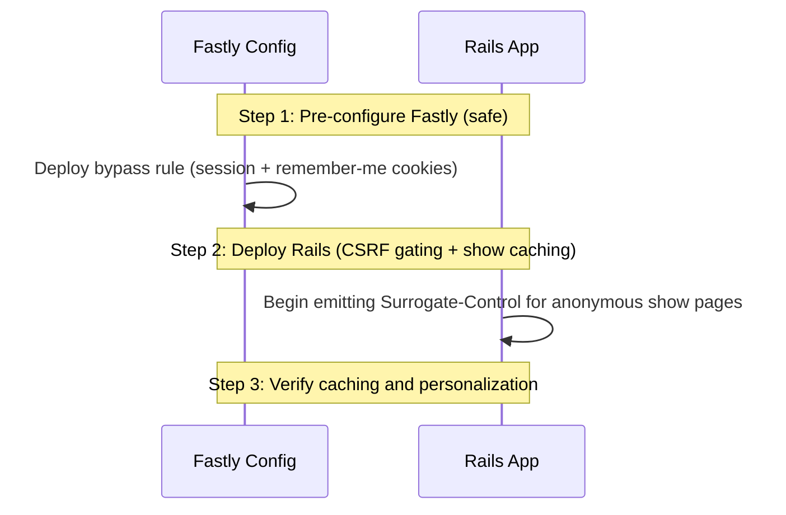

# CDN Caching for Anonymous Traffic

This document describes the design, rationale, and implementation plan to
increase CDN (Fastly) caching of "project show" pages for anonymous users
(web spiders and guest visitors) while ensuring that logged-in users, and
any user with personalized state (such as those receiving a stored
"flash" message) continue to receive correct, non-cached content.

The approach here deliberately **avoids adding a new cookie**. Instead it
treats the *presence of the existing Rails session cookie*
(`_BadgeApp_session`) as the single "do not cache" signal, and **minimizes
the number of situations in which we write anything into that cookie**. The
key enabling change is to stop emitting a CSRF token (and therefore a
session cookie) on anonymous read-only pages that do not need one.

---

## 1. Problem Statement

The Best Practices Badge application has over 10,000 projects, each with
multiple sections (currently 7) translated into 9 languages, totaling over
600,000 page combinations when doing a "show project".
Each "show project" page is about 200KiB. Currently, our CDN
(Fastly) is a pass-through for all HTML page requests, and only a few
kinds of resources (such as badge images) are cached by the CDN.

Because multiple web spiders and crawlers constantly trawl the site without
breaks, the Rails origin server receives a high volume of heavy HTML
rendering requests. This leads to server load spikes, database strain,
latency issues, and overwhelming log entries.

We want the CDN to serve cached copies of "project show" pages to anonymous
visitors (especially spiders) who are not receiving personalized content,
while never serving a cached page to a user who should see personalized
content (logged-in users, users with a flash message, etc.).

---

## 2. Why Not Add a New Cookie?

An earlier draft proposed adding a new public, unencrypted cookie (e.g.
`user_logged_in=true`) set only when a user is authenticated, and bypassing
the CDN cache only when that cookie is present. The reasoning was that
anonymous guests "occasionally" receive a `_BadgeApp_session` cookie for
transient reasons (CSRF tokens, flash messages), so keying the CDN bypass
on `_BadgeApp_session` would needlessly bypass the cache for those guests
and lower the hit rate.

That reasoning is real, but a new cookie is the wrong fix:

* **It duplicates state.** The login status would now live in two places
  (the encrypted session *and* a plaintext cookie) that must be kept in
  sync. Drift between them is a latent source of bugs.
* **It is a new, misleading attack surface.** A plaintext `user_logged_in`
  cookie reads like an authentication flag to reviewers and auditors even
  though it is only a CDN routing hint. Minimizing such surfaces is a core
  project value.
* **It tracks the wrong thing.** It signals "logged in", but what we
  actually must not cache is "anything personalized" — which includes
  flash messages and any future per-user session state, not just login.
  The session cookie already captures *all* of that.
* **It is unnecessary.** The supposed benefit (guests carrying a session
  cookie) largely disappears once we stop writing the session cookie
  gratuitously. The dominant cause of guests carrying `_BadgeApp_session`
  is the CSRF token emitted on every page — and anonymous read-only pages
  do not need it (see Section 4).

Additional context on cookie retention: the primary load source is web
spiders, and major crawlers (Googlebot, Bingbot, and most simple HTTP
clients) are **stateless and do not retain cookies**. They therefore arrive
with no `_BadgeApp_session` at all and are cached cleanly under either
design. The new-cookie advantage only ever applied to *cookie-retaining
humans*, which is exactly the population we address below by not setting the
cookie in the first place.

**Decision:** Use `_BadgeApp_session` presence as the cache-bypass signal,
fail safe (any session state ⇒ bypass), and minimize when we set it.

---

## 3. How `_BadgeApp_session` Gets Set (Complete Enumeration)

`_BadgeApp_session` is Rails' encrypted `cookie_store` session
(`config/initializers/session_store.rb`). Rails emits a
`Set-Cookie: _BadgeApp_session=...` response header whenever a request
*writes* data into the session (and the write is not suppressed — see
`omit_session_cookie` below). Once set, the browser sends the cookie on
**every** subsequent request until it expires or the session is reset. So
to keep the cookie absent for anonymous read-only traffic, we must avoid
*every* write below for that traffic.

Reading the session (e.g. `session[:user_id]`) does **not** write it; only
the following do.

### A. Authentication and session lifecycle (logged-in users)

These are expected and correct — logged-in users must not be served cached
anonymous pages, so setting the cookie here is exactly what we want.

1. **Successful login.** `log_in` writes `session[:user_id]` and
   `session[:time_last_used]`
   ([`app/helpers/sessions_helper.rb:49-50`](../app/helpers/sessions_helper.rb)),
   and rewrites `session[:forwarding_url]` if present (line 55).
2. **Remember-me auto-login.** `try_remember_token_login` writes
   `session[:user_id]` and `session[:time_last_used]`
   ([`app/controllers/application_controller.rb:573-574`](../app/controllers/application_controller.rb))
   when a returning user is logged in from the persistent
   `remember_token` / `user_id` cookies.
3. **Session timestamp refresh.** `update_session_timestamp` (an
   `after_action`) writes `session[:time_last_used]`
   ([`app/controllers/application_controller.rb:551`](../app/controllers/application_controller.rb)).
   It returns early unless `@session_user_id` is set, so it never fires for
   anonymous users.
4. **GitHub OAuth callback.** Writes `session[:user_token]` and
   `session[:github_name]`
   ([`app/controllers/sessions_controller.rb:136-137`](../app/controllers/sessions_controller.rb)).

### B. Pre-login navigation memory (can affect anonymous users)

These happen *before* a user is authenticated, so they can set the cookie
for an otherwise-anonymous visitor. They occur only on the login / signup
flow and on pages that require login, none of which are cacheable, so they
do not interfere with caching the *show* page — but they are listed for
completeness.

5. **`store_location_and_locale`** writes `session[:locale]` (always) and
   `session[:forwarding_url]`
   ([`app/helpers/sessions_helper.rb:281-294`](../app/helpers/sessions_helper.rb)).
   Called from the login flow
   ([`app/controllers/sessions_controller.rb:28`](../app/controllers/sessions_controller.rb))
   and from `projects#new`
   ([`app/controllers/projects_controller.rb:568`](../app/controllers/projects_controller.rb)).
6. **`store_internal_referer`** writes `session[:forwarding_url]`
   ([`app/helpers/sessions_helper.rb:347`](../app/helpers/sessions_helper.rb)).
7. **`projects#new`** writes `session[:forwarding_url] = new_project_url`
   ([`app/controllers/projects_controller.rb:571`](../app/controllers/projects_controller.rb)).

### C. Flash messages (stored in the session)

The flash lives in the session, so setting a *persistent* flash writes the
cookie.

8. **Persistent flash** — `flash[:danger|success|info|warning|notice|error]
   = ...`. These are set throughout the controllers, e.g. login
   success/failure and sign-out
   ([`sessions_controller.rb`](../app/controllers/sessions_controller.rb)),
   signup and profile/delete
   ([`users_controller.rb`](../app/controllers/users_controller.rb)),
   project create / update / delete and badge changes
   ([`projects_controller.rb`](../app/controllers/projects_controller.rb)),
   password reset
   ([`password_resets_controller.rb`](../app/controllers/password_resets_controller.rb)),
   account activation
   ([`account_activations_controller.rb`](../app/controllers/account_activations_controller.rb)),
   and unsubscribe
   ([`unsubscribe_controller.rb`](../app/controllers/unsubscribe_controller.rb)).
   A persistent flash is carried to the **next** request: the response that
   sets it emits `Set-Cookie`, and the browser then sends `_BadgeApp_session`
   on following requests until the flash is displayed and swept.

   * **`flash.now[...]`** is request-local: it is swept at the end of the
     current request and, if it is the only session data, leaves the
     session empty, so it does **not** persist a cookie to later requests.
     (During the current render `flash.empty?` is still false, so the show
     action's guard below will not cache that particular response anyway.)

### D. CSRF protection (the dominant cause for anonymous read-only pages)

9. **`csrf_meta_tags` in the layout `<head>`**
   ([`app/views/layouts/application.html.erb:7`](../app/views/layouts/application.html.erb)).
   This helper calls `form_authenticity_token`, which executes
   `session[:_csrf_token] ||= ...`. It is currently emitted on **every**
   rendered page, including anonymous read-only pages that contain no forms
   and no JavaScript that uses the token. This single line is why ordinary
   human guests accumulate a `_BadgeApp_session` cookie.
10. **Form helpers** (`form_with` / `form_tag`) embed a hidden
    `authenticity_token` field, which also writes `session[:_csrf_token]`
    when the form is rendered. This applies to login, signup, password
    reset, unsubscribe, account activation, and project new/edit/delete
    forms. These pages are personalized and/or POST targets and are not
    cacheable, so this write is acceptable.

### Summary of what matters for caching the show page

For an **anonymous GET of a read-only page**, the only write that normally
fires is **item 9 (the CSRF meta tag)**. Items 1–4 require being logged in,
items 5–7 require the login/new-project flow, item 8 (persistent) requires
an action that sets a flash, and item 10 requires rendering a form.
Eliminating item 9 for anonymous read-only pages removes the gratuitous
session cookie and makes "`_BadgeApp_session` is present" a precise signal
for "this response may be personalized — do not cache".

---

## 4. The Approach

Three coordinated changes:

1. **Stop writing the CSRF token on anonymous read-only pages** by making
   `csrf_meta_tags` conditional. Forms keep working because `form_with`
   embeds its own hidden `authenticity_token` independent of the meta tag,
   and the only JavaScript consumer of the meta tag (jQuery UJS
   `link_to ... method:` links such as logout and user-delete) appears only
   on logged-in pages.
2. **Enable CDN caching of anonymous `projects#show` HTML** when there is no
   per-user state, reusing the existing `cache_on_cdn` (which already calls
   `omit_session_cookie`, guaranteeing no `Set-Cookie` on the cached
   response).
3. **Configure Fastly** to bypass the cache for page requests whenever the
   request carries `_BadgeApp_session` *or* the persistent remember-me
   cookies (`remember_token` / `user_id`).

### Why this is safe

* The CDN bypass is **fail-safe**: *any* session state (login, flash, CSRF,
  or future per-user data) means the cookie is present, so the request is
  passed to the origin and the personalized response is rendered fresh.
* `cache_on_cdn` calls `omit_session_cookie`
  ([`app/controllers/application_controller.rb:288`](../app/controllers/application_controller.rb)),
  which sets `request.session_options[:skip] = true`, so a cached anonymous
  response never carries a `Set-Cookie` header even though rendering may
  have touched the session in memory.
* Logged-in users vary the page header (account menu, logout, edit
  buttons). They always carry `_BadgeApp_session`, so they always bypass the
  cache and never receive the anonymous header.
* Remember-me users whose 48-hour session
  (`SessionsHelper::SESSION_TTL`) has expired may arrive **without**
  `_BadgeApp_session` but **with** the persistent `remember_token` /
  `user_id` cookies; the Fastly rule bypasses the cache for those cookies
  too, so they are not served a cached anonymous page.

---

## 5. Exact Code Changes

### Change 1: Make `csrf_meta_tags` conditional

In [`app/views/layouts/application.html.erb`](../app/views/layouts/application.html.erb),
replace the unconditional tag:

```erb
  <%= csrf_meta_tags %>
```

with a guarded version:

```erb
  <%#
    Only emit the CSRF token when it can actually be used. Emitting it calls
    form_authenticity_token, which writes session[:_csrf_token] and forces a
    _BadgeApp_session cookie -- defeating CDN caching for anonymous visitors.
    Anonymous read-only pages need no token: form_with embeds its own hidden
    authenticity_token (so login/signup/reset forms still work), and the only
    JavaScript consumer of this meta tag (jQuery UJS "method:" links such as
    logout and user-delete) appears only on logged-in pages. See
    docs/cdn-cache-not-logged-in.md.
  -%>
  <% if logged_in? %><%= csrf_meta_tags %><% end %>
```

`logged_in?` is the existing `SessionsHelper` predicate
(`@session_user_id.present?`) and is available in views.

### Change 2: Cache anonymous `projects#show` HTML

In [`app/controllers/projects_controller.rb`](../app/controllers/projects_controller.rb),
the `show` action currently caches only the markdown format:

```ruby
    # Enable CDN caching for markdown format (no user-specific content)
    cache_on_cdn if request.format.symbol == :md
```

Replace it with a guard that also caches anonymous, flash-free HTML:

```ruby
    # Enable CDN caching when the response carries no per-user state.
    #   - :md is always safe (no layout/header, no forms, no CSRF token).
    #   - :html is safe only when the user is not logged in AND there is no
    #     flash, and only when the CACHE_SHOW_PROJECT kill switch is on.
    # cache_on_cdn also calls omit_session_cookie, so no Set-Cookie is sent.
    if request.format.symbol == :md ||
       (CACHE_SHOW_PROJECT && request.format.symbol == :html &&
        !logged_in? && flash.empty?)
      cache_on_cdn
    end
```

`CACHE_SHOW_PROJECT` already exists
([`projects_controller.rb:110`](../app/controllers/projects_controller.rb),
from `ENV['BADGEAPP_CACHE_SHOW_PROJECT']`) and serves as the kill switch:
set `BADGEAPP_CACHE_SHOW_PROJECT=false` to instantly fall back to
`private, no-store` for HTML show pages without a redeploy.

No change is needed to `cache_on_cdn`, `omit_session_cookie`, or
`set_default_cache_control`; the default for any non-cached response remains
`private, no-store`.

### Change 3: Fastly configuration

Bypass the cache for page requests (not assets, badges, or JSON) whenever
the request carries the session cookie or the persistent remember-me
cookies.

#### Option A: Fastly Web UI Request Setting (recommended)

* **Name:** `Bypass cache for personalized requests`
* **Action:** `Pass`
* **Condition** — Apply if:

  ```text
  req.http.Cookie ~ "(_BadgeApp_session|remember_token|user_id)=" && req.url.path !~ "\.(css|js|png|gif|jpg|jpeg|svg|json|csv|txt|ico|woff2?|map)$" && req.url.path !~ "/(badge|baseline)$"
  ```

#### Option B: Custom VCL snippet (placement: `recv`)

```vcl
# Page requests only (not static assets, badges, or JSON APIs).
if (req.url.path !~ "\.(css|js|png|gif|jpg|jpeg|svg|json|csv|txt|ico|woff2?|map)$" &&
    req.url.path !~ "/(badge|baseline)$") {

  # Bypass the cache for any request that may be personalized:
  # an active Rails session, or a persistent remember-me login.
  if (req.http.Cookie ~ "(_BadgeApp_session|remember_token|user_id)=") {
    return(pass);
  }
}

# Maximize the guest hit rate: drop cookies unrelated to login/session so
# that otherwise-identical anonymous requests share one cache object.
if (req.http.Cookie && req.http.Cookie !~ "(_BadgeApp_session|remember_token|user_id)=") {
  unset req.http.Cookie;
}
```

---

## 6. Tests to Ensure It Is Secure

These tests lock in the security-critical invariants. The most important is
the negative one: an anonymous read-only request must never carry a session
cookie, because that is the property the CDN bypass relies on.

Add to an integration test (e.g.
`test/integration/cdn_caching_test.rb`):

```ruby
# frozen_string_literal: true

# Copyright the OpenSSF Best Practices badge contributors
# SPDX-License-Identifier: MIT

require 'test_helper'

class CdnCachingTest < ActionDispatch::IntegrationTest
  setup do
    @project = projects(:one)
  end

  # The CDN treats "has _BadgeApp_session" as "do not cache". Anonymous
  # read-only pages must therefore NOT set that cookie. If this fails, the
  # CDN would needlessly bypass the cache for ordinary guests.
  test 'anonymous read-only GETs set no session cookie' do
    [
      '/en',
      '/en/projects',
      "/en/projects/#{@project.id}"
    ].each do |path|
      get path
      assert_response :success
      assert_nil cookies['_BadgeApp_session'],
                 "#{path} unexpectedly set _BadgeApp_session"
      assert_not response.headers['Set-Cookie'].to_s.include?('_BadgeApp_session'),
                 "#{path} unexpectedly emitted a session Set-Cookie"
    end
  end

  # Anonymous project show (HTML) is cacheable: it must advertise a
  # Surrogate-Control header to the CDN and must not emit a session cookie.
  test 'anonymous project show is CDN-cacheable' do
    get "/en/projects/#{@project.id}"
    assert_response :success
    assert response.headers['Surrogate-Control'].present?,
           'show should send Surrogate-Control for the CDN'
    assert_equal 'no-store', response.headers['Cache-Control']
    assert_nil cookies['_BadgeApp_session']
  end

  # Logged-in users must bypass the cache: they get the personalized header,
  # a session cookie, and a private, non-cacheable response.
  test 'logged-in project show is not CDN-cacheable' do
    log_in_as(users(:test_user))
    get "/en/projects/#{@project.id}"
    assert_response :success
    assert_equal 'private, no-store', response.headers['Cache-Control']
  end

  # A flash present on the show response must suppress caching.
  test 'project show with a flash is not CDN-cacheable' do
    get "/en/projects/#{@project.id}", flash: { danger: 'boom' }
    assert_equal 'private, no-store', response.headers['Cache-Control']
  end
end
```

Add to a view/controller test asserting the CSRF meta tag is gated on login
(e.g. in an existing layout or projects show test):

```ruby
# The CSRF meta tag must be absent for anonymous users (so no session
# cookie is written) and present for logged-in users (UJS links need it).
test 'csrf meta tag is gated on login' do
  get "/en/projects/#{projects(:one).id}"
  assert_select 'meta[name="csrf-token"]', count: 0

  log_in_as(users(:test_user))
  get "/en/projects/#{projects(:one).id}"
  assert_select 'meta[name="csrf-token"]', count: 1
end
```

Confirm existing CSRF behavior still holds (these paths must keep working
even though the meta tag is gone for anonymous users, because forms supply
their own token). The suite already exercises these; verify they still pass:

* **Login** succeeds via the `sessions/new` form (POST validates the
  hidden `authenticity_token`).
* **Signup** succeeds via the `users/new` form.
* **Password reset** request and update succeed.
* **Logout** works for a logged-in user (the UJS `method: "delete"`
  link relies on the meta tag, which *is* present when logged in).

> **Note:** request forgery protection is disabled in the test environment
> (`config/environments/test.rb`), so to meaningfully test that anonymous
> POST forms still validate CSRF, either add a focused test with
> `ActionController::Base.allow_forgery_protection = true` around it, or
> rely on the existing system tests that submit the real forms.

---

## 7. Rollout Order

Deploy Fastly first; it is safe because Rails is not yet emitting cacheable
HTML, so Fastly keeps passing all HTML through.



1. **Deploy Fastly bypass rule** (Section 5, Change 3). Until Rails sends
   `Surrogate-Control`, Fastly still passes all HTML to the origin.
2. **Deploy Rails changes** (Section 5, Changes 1 and 2). Anonymous show
   pages immediately become cacheable; the already-active bypass rule keeps
   logged-in and remember-me users on the origin.
3. **Verify** with the staging tests below; if anything is wrong, set
   `BADGEAPP_CACHE_SHOW_PROJECT=false` to disable HTML caching instantly.

---

## 8. How to Verify on Staging

### Anonymous request is cached

```bash
curl -svo /dev/null -H "Fastly-Debug: 1" \
  https://staging.bestpractices.dev/en/projects/1 2>&1 \
  | grep -E "X-Cache|Surrogate-Control|Cache-Control|Set-Cookie"
# Run twice: first MISS then HIT. There must be NO Set-Cookie:_BadgeApp_session.
```

### Request carrying a session cookie bypasses the cache

```bash
curl -svo /dev/null -H "Fastly-Debug: 1" \
  -H "Cookie: _BadgeApp_session=anything" \
  https://staging.bestpractices.dev/en/projects/1 2>&1 \
  | grep -E "X-Cache|Cache-Control"
# Must be PASS/MISS, never HIT; Cache-Control: private, no-store.
```

### Remember-me cookie bypasses the cache

```bash
curl -svo /dev/null -H "Fastly-Debug: 1" \
  -H "Cookie: remember_token=anything" \
  https://staging.bestpractices.dev/en/projects/1 2>&1 \
  | grep -E "X-Cache|Cache-Control"
# Must be PASS/MISS, never HIT.
```

### Badges and JSON still cache regardless of cookies

```bash
curl -svo /dev/null -H "Fastly-Debug: 1" \
  -H "Cookie: _BadgeApp_session=anything" \
  https://staging.bestpractices.dev/en/projects/1.json 2>&1 | grep -E "X-Cache"
# Second request must be HIT.
```

---

## 9. Residual Risks and Edge Cases

* **Adding anonymous JavaScript that needs the CSRF token.** If a future
  page adds an anonymous `link_to ... method:`, `button_to` to a non-GET
  action driven by UJS, or an anonymous non-GET AJAX call, it will need the
  meta tag. (`button_to` and `form_with` are fine — they embed their own
  hidden token.) The "csrf meta tag is gated on login" test and the
  "anonymous read-only GETs set no session cookie" test will catch the
  common cases; reviewers should watch for new anonymous UJS/AJAX.
* **A persistent flash to an anonymous user.** If an anonymous user receives
  a persistent `flash[...]` (rare on read-only paths), the response that
  sets it is not cached (it sets a cookie and the show guard sees a
  non-empty flash), and the browser then carries `_BadgeApp_session` until
  the flash is shown — those follow-up requests safely bypass the cache.
  Prefer `flash.now[...]` for messages rendered on a `render` (not a
  redirect) to avoid leaving a lingering cookie.
* **Cache invalidation on project edits.** `projects#show` already emits a
  `Surrogate-Key` of the project's `record_key`; ensure project updates
  purge that surrogate key so cached anonymous pages are refreshed promptly.
* **Header variance.** The page header differs for logged-in vs anonymous
  users. Caching is correct only because logged-in users always carry
  `_BadgeApp_session` and bypass the cache; do not weaken the bypass rule.
