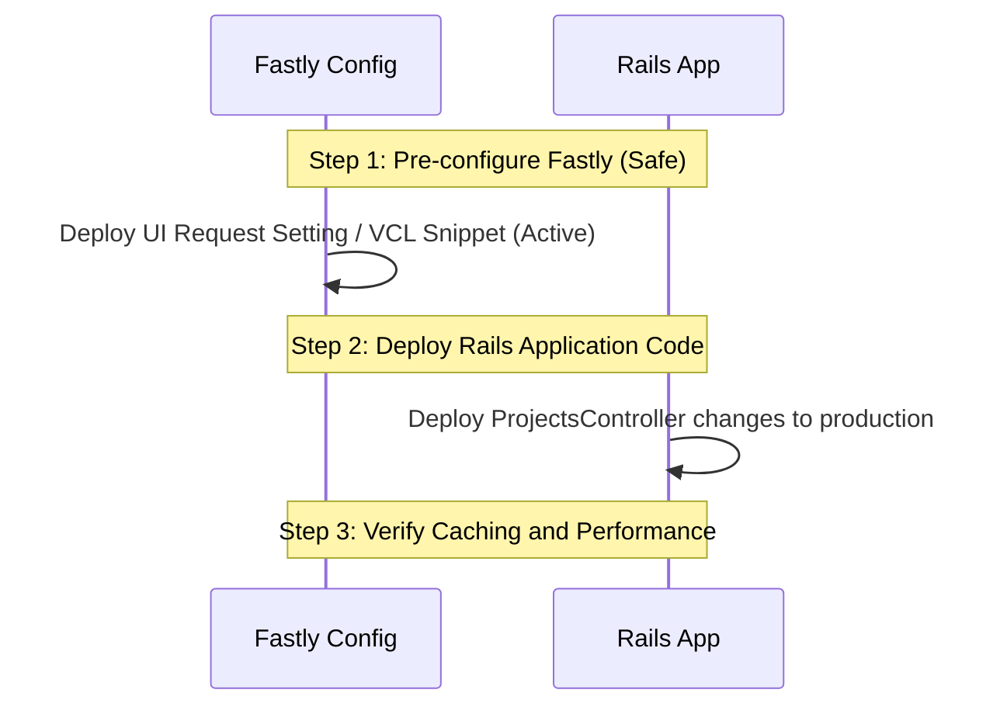

# CDN Caching for Anonymous Traffic (Option B)

This document describes the design, implementation, and deployment plan to increase CDN (Fastly) caching of "project show" pages for anonymous users (specifically web spiders and guest visitors) while ensuring logged-in users continue to receive personalized content.

**NOTE**: Currently this sets `user_logged_in=true` when a user is actually authenticated (so we can distinguish logged-in from flash), but the name may mislead reviewers into thinking this is an authentication bypass. We need a better name like `restrict_cdn_caching=true` instead. ALSO: It's not clear we need a separate cookie at all. If `_BadgeApp_session` is set, we don't want to use the CDN cache no matter what at the CDN side for personalized pages, right, since we want to disable if we have flash, or user personalization, or a token for editing. I *think* we can just use `_BadgeApp_session`.

---

## 1. Problem Statement

The Best Practices Badge application has over 10,000 projects, each with multiple sections (currently 7) translated into 9 languages, totaling over 600,000 page combinations. Each page is about 200KiB. Currently, our CDN (Fastly) is a pass-through for all HTML page requests.

Because multiple web spiders and crawlers constantly trawl the site without breaks, the Rails origin server receives a high volume of heavy HTML rendering requests. This leads to server load spikes, database strain, and latency issues.

---

## 2. Proposed Solution (Option B: Auth-Bypass Caching via Logged-In Cookie)

In Rails, the session cookie `_BadgeApp_session` is set when a user logs in, and logged-in users in many cases get a different per-user view that we can't globally cache. However, in Rails, guest users can occasionally receive a session cookie (`_BadgeApp_session`) for transient reasons, such as when a flash message is set (e.g. login failure) or CSRF tokens are stored. If we simply bypass the cache for any request with a session cookie, many guests would bypass the cache and hit the origin, reducing the CDN cache hit rate.

To solve this, we will use a **Logged-In Cookie Pattern**:

1. We set a lightweight, public, unencrypted cookie `user_logged_in=true` *only* when a user is actually authenticated.
2. We configure Fastly to bypass the cache on possibly-personalized content *only* if the `user_logged_in=true` cookie is present in the request.
3. Registered, logged-in users (possessing `user_logged_in=true`) will bypass the cache and hit the Rails origin server directly to receive a fully personalized interface (Profile menus, Edit/Delete buttons, and flash messages).
4. Spiders and guest users (who generally do not have this cookie) will always be served from the CDN edge cache.

---

## 3. Rails Code Changes

To implement this, we need to make two changes to the Rails app:

1. Manage the `user_logged_in` cookie dynamically.
2. Enable caching in the project show controller.

### Code Modification 1: Manage `user_logged_in` Cookie

We update `setup_authentication_state` in [app/controllers/application_controller.rb](file:///home/dwheeler/best-practices-badge/app/controllers/application_controller.rb) to automatically keep the cookie in sync with the user's login state:

```ruby
# In app/controllers/application_controller.rb
def setup_authentication_state
  # ... (existing session decryption logic)

  # Set instance variables from the encrypted session cookie.
  @session_user_id = user_id
  @session_timestamp = timestamp
  @session_user_token = session[:user_token]
  @session_github_name = session[:github_name]

  # Dynamic logged_in cookie management for CDN cache routing
  if @session_user_id.present?
    # Set public unencrypted cookie for the CDN (expires in 20 years)
    cookies[:user_logged_in] = { value: 'true', expires: 20.years.from_now } unless cookies[:user_logged_in] == 'true'
  else
    # Delete the cookie if the session is not present/expired
    cookies.delete(:user_logged_in) if cookies[:user_logged_in].present?
  end
end
```

### Code Modification 2: Enable Caching in projects#show

We update the show action in [app/controllers/projects_controller.rb](file:///home/dwheeler/best-practices-badge/app/controllers/projects_controller.rb):

```ruby
# In app/controllers/projects_controller.rb
def show
  # ... (other setup and loading logic)

  # Enable CDN caching for MD format, and HTML format when safe:
  # 1. Caching is enabled for HTML requests only if:
  #    - The user is NOT logged in.
  #    - There are no active flash messages.
  #    - The fallback switch CACHE_SHOW_PROJECT is enabled.
  if request.format.symbol == :md ||
     (CACHE_SHOW_PROJECT && request.format.symbol == :html &&
      !logged_in? && flash.empty?)
    cache_on_cdn
  end

  # Respond to different formats
  respond_to do |format|
    format.html # Renders projects/show.html.erb
    format.md { render_markdown_format }
  end
end
```

### Environment Parameter Toggle

We use the pre-existing environment variable `BADGEAPP_CACHE_SHOW_PROJECT` (which is mapped to the `CACHE_SHOW_PROJECT` constant in [projects_controller.rb](file:///home/dwheeler/best-practices-badge/app/controllers/projects_controller.rb)) to serve as a kill switch:

* **To disable this new behavior:** Set `BADGEAPP_CACHE_SHOW_PROJECT=false` in the application environment (e.g., on Heroku).
* **Effect:** The controller will fall back to its previous behavior (setting `private, no-store` for all HTML show requests), disabling CDN caching for HTML pages immediately without requiring a code redeploy.

---

## 4. Fastly Configuration Changes

Fastly must be configured to bypass the cache when the `user_logged_in=true` cookie is present, but **only for page requests**. We must continue to cache assets (CSS, JS, images), SVG badges, and JSON files even for logged-in users.

This can be done using either Fastly's Web UI Request Settings or a Custom VCL Snippet.

### Option A: Via Fastly Web UI Request Settings (Recommended)

1. Go to **Settings** > **Request Settings** > **Create Request Setting**.
2. Configure the setting:
   * **Name:** `Bypass Cache for Logged-In Users`
   * **Action:** `Pass` (bypasses cache lookup).
3. Under **Conditions**, click **Create Condition**:
   * **Name:** `Is Logged-In HTML Request`
   * **Apply if:**

     ```text
     req.http.Cookie ~ "user_logged_in=true" && req.url.path !~ "\.(css|js|png|gif|jpg|jpeg|svg|json|csv|txt|ico|woff2?|map)$" && req.url.path !~ "/(badge|baseline)$"
     ```

### Option B: Via Custom VCL Snippet

If you manage configuration using custom VCL, add the following snippet inside the `vcl_recv` block (set placement to `recv` if using the VCL Snippets tool):

```vcl
# Check if the request is an HTML page (not static assets, badges, or JSON APIs)
if (req.url.path !~ "\.(css|js|png|gif|jpg|jpeg|svg|json|csv|txt|ico|woff2?|map)$" &&
    req.url.path !~ "/(badge|baseline)$") {

  # If the user has the logged-in cookie, bypass the cache
  if (req.http.Cookie ~ "user_logged_in=true") {
    return(pass);
  }
}

# (Optional) Strip non-essential cookies for guests to maximize cache hit rate.
# Retain only the Rails session cookie (if any) and the user_logged_in cookie.
if (req.http.Cookie && req.http.Cookie !~ "(_BadgeApp_session|user_logged_in)") {
  unset req.http.Cookie;
}
```

---

## 5. Required Order of Events for Rollout

To prevent logged-in users from seeing cached anonymous pages, follow this order of events:



1. **Step 1: Deploy Fastly Configuration (First)**
   * Deploy and activate the Fastly VCL snippet or Request Setting.
   * **Why first:** It is completely safe to deploy first. Because the Rails app has not yet been modified to output `Surrogate-Control` headers, Fastly will still pass-through all HTML page requests.
2. **Step 2: Deploy Rails Application Code (Second)**
   * Merge and deploy the Rails code change to production.
   * As soon as Rails is deployed, it will start sending `Surrogate-Control` headers for anonymous traffic. Fastly will immediately begin caching those responses. Since Fastly already has the bypass rule active, logged-in users will safely bypass the cache.

---

## 6. How to Test on Staging

Use these command-line tests on your staging site to verify that caching is behaving correctly.

### Test 1: Verify Caching for Anonymous Requests (Guests)

Send a request to a project show page on staging without any cookies:

```bash
# First request (should miss the cache)
curl -svo /dev/null -H "Fastly-Debug: 1" https://staging.bestpractices.dev/en/projects/1 2>&1 | grep -E "X-Cache|Surrogate-Control|Cache-Control"

# Second request (should hit the cache)
curl -svo /dev/null -H "Fastly-Debug: 1" https://staging.bestpractices.dev/en/projects/1 2>&1 | grep -E "X-Cache|Surrogate-Control|Cache-Control"
```

**Expected Results:**

* First request: `X-Cache: MISS` (and/or `X-Cache-Hits: 0`), `Surrogate-Control` is present, `Cache-Control` is `no-store`.
* Second request: `X-Cache: HIT` (and/or `X-Cache-Hits: 1`).

---

### Test 2: Verify Cache-Bypass for Logged-In Users

Send a request simulating a logged-in user by passing the logged-in cookie:

```bash
# Request with logged-in cookie
curl -svo /dev/null -H "Fastly-Debug: 1" -H "Cookie: user_logged_in=true" https://staging.bestpractices.dev/en/projects/1 2>&1 | grep -E "X-Cache|Surrogate-Control|Cache-Control"

# Repeat request
curl -svo /dev/null -H "Fastly-Debug: 1" -H "Cookie: user_logged_in=true" https://staging.bestpractices.dev/en/projects/1 2>&1 | grep -E "X-Cache|Surrogate-Control|Cache-Control"
```

**Expected Results:**

* Both requests must return `X-Cache: PASS` or `MISS` (never a `HIT`).
* `Cache-Control` returned from origin should be `private, no-store`.

---

### Test 3: Verify Caching of Badge Images and JSON for Logged-In Users

Verify that badge images and JSON files are still cached even when the user has a logged-in cookie:

```bash
# JSON request with logged-in cookie
curl -svo /dev/null -H "Fastly-Debug: 1" -H "Cookie: user_logged_in=true" https://staging.bestpractices.dev/en/projects/1.json 2>&1 | grep -E "X-Cache"

# JSON request again
curl -svo /dev/null -H "Fastly-Debug: 1" -H "Cookie: user_logged_in=true" https://staging.bestpractices.dev/en/projects/1.json 2>&1 | grep -E "X-Cache"
```

**Expected Results:**

* Second JSON request must return `X-Cache: HIT`.
